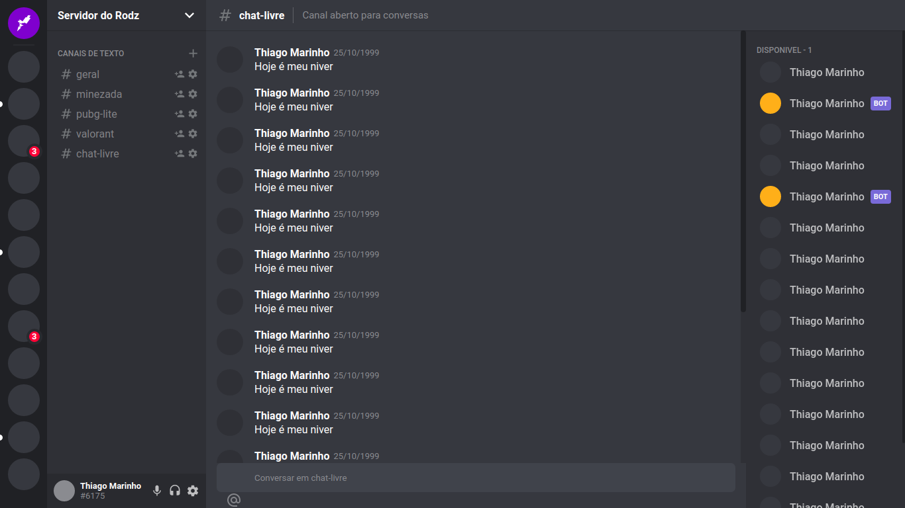

<h1 aling="center">Clone Discord</h1>

 

 

## Tecnologias

Esse projeto foi desenvolvido com as seguintes tecnologias:

- [React](https://reactjs.org)
- [Styled-Components](https://www.styled-components.com/)
- [Typescript](https://www.typescriptlang.org/)

## Descrição

Esse é um projeto de clone do [Discord](https://discord.com/new) em ReactJS com Typescript, com o objetivo de estudo na área.
